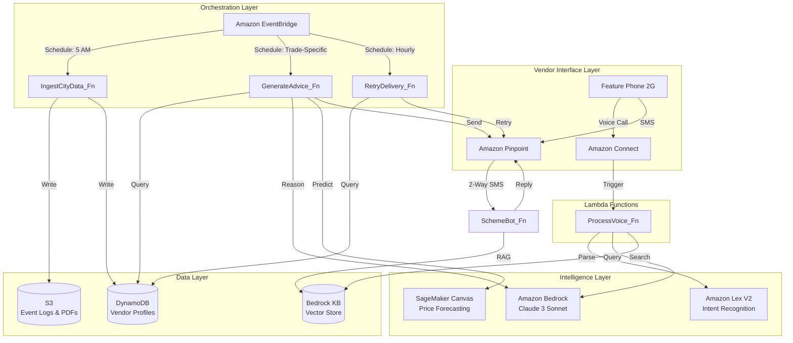

# Design Document: SignalWorks

## Overview

SignalWorks is a serverless, event-driven AI platform that delivers Market Intelligence to India's street vendors via SMS and IVR on basic 2G feature phones. The architecture leverages AWS managed services to achieve low operational cost, high scalability, and zero infrastructure management.

### Architectural Style

**Event-Driven Serverless Architecture**: The platform operates on a "push-based" intelligence model where data changes (Events) trigger AI Analysis (Bedrock) which triggers Actions (SMS/Voice). This eliminates polling, reduces costs, and ensures real-time responsiveness.

### Core Design Principles

1. **Zero Infrastructure Management**: All compute runs on AWS Lambda with automatic scaling
2. **Pay-Per-Use Economics**: Services scale to zero when idle, optimizing for AWS Free Tier
3. **Event-Driven Orchestration**: Amazon EventBridge coordinates all workflows
4. **AI-First Intelligence**: Amazon Bedrock provides reasoning without ML expertise
5. **Resilience by Design**: Store-and-forward patterns ensure delivery in poor connectivity
6. **Privacy by Default**: Data aggregation and hashing protect vendor identity

### Technology Stack

| Layer | AWS Service | Purpose |
|-------|-------------|---------|
| Compute | AWS Lambda (Python 3.12) | All business logic execution |
| Orchestration | Amazon EventBridge | Scheduled triggers and event routing |
| AI Reasoning | Amazon Bedrock (Claude 3 Sonnet) | Cross-dataset intelligence via LangChain |
| Predictive Analytics | Amazon SageMaker Canvas | Time-series price forecasting |
| Voice Interface | Amazon Connect + Lex V2 + Polly | IVR with dialect support |
| SMS Gateway | Amazon Pinpoint | Transactional SMS with 2-way support |
| Hot Data Store | Amazon DynamoDB (On-Demand) | Vendor profiles and active events |
| Cold Data Store | Amazon S3 | Raw event logs and scheme PDFs |
| Vector Store | Amazon Bedrock Knowledge Base | RAG for government schemes |
| Encryption | AWS KMS | Customer-managed keys for data protection |
| Monitoring | Amazon CloudWatch | Metrics, logs, and alarms |


## Architecture

### High-Level System Architecture



### Event-Driven Data Flow

**Morning Intelligence Pipeline (Daily)**:
1. **5:00 AM**: EventBridge triggers `IngestCityData_Fn`
   - Scrapes City Event APIs, Mandi Price APIs, Weather APIs
   - Writes raw data to S3 (audit trail)
   - Writes structured events to DynamoDB Events Table
2. **Trade-Specific Times** (4 AM - 6 PM): EventBridge triggers `GenerateAdvice_Fn` for each trade cohort
   - Queries DynamoDB for vendors in that trade category
   - Calls Bedrock with vendor profile + event context
   - Bedrock generates location recommendation + reason code
   - Calls SageMaker for price prediction
   - Composes SMS in vendor's language
   - Sends via Pinpoint with delivery tracking
3. **Delivery Failures**: Written to DynamoDB FailedMessages Table
4. **Hourly**: EventBridge triggers `RetryDelivery_Fn`
   - Queries FailedMessages Table
   - Implements exponential backoff
   - Retries via Pinpoint for up to 24 hours

**Real-Time Voice Query Flow**:
1. Vendor calls toll-free number → Amazon Connect answers
2. Connect streams audio to Lex V2 for intent recognition
3. Lex extracts parameters (location, commodity, question type)
4. Connect triggers `ProcessVoice_Fn` Lambda
5. Lambda queries Bedrock with real-time context
6. Bedrock generates natural language response
7. Lambda returns response to Connect
8. Connect uses Polly to synthesize speech in vendor's language
9. If call drops: Lambda sends SMS with answer via Pinpoint

**RAG-Based Scheme Query Flow**:
1. Vendor sends SMS: "Loan help"
2. Pinpoint routes to `SchemeBot_Fn` Lambda
3. Lambda queries Bedrock Knowledge Base (vector search on scheme PDFs)
4. Bedrock returns relevant scheme with eligibility
5. Lambda generates simplified 3-step guide
6. Lambda sends SMS response via Pinpoint


## Components and Interfaces

### Lambda Functions (Microservices)

#### 1. IngestCityData_Fn

**Purpose**: Scrape and normalize data from external APIs

**Trigger**: EventBridge CRON (5:00 AM daily)

**Runtime**: Python 3.12, 512 MB memory, 5-minute timeout

**Logic**:
```python
def handler(event, context):
    # Parallel API calls using asyncio
    event_data = fetch_city_events()  # City calendars, temple schedules
    traffic_data = fetch_traffic_data()  # Metro/Bus APIs
    weather_data = fetch_weather_forecast()  # IMD or OpenWeather
    mandi_prices = fetch_mandi_prices()  # e-NAM API
    
    # Write raw data to S3 for audit
    s3.put_object(Bucket='signalworks-raw-data', 
                  Key=f'events/{date}.json', 
                  Body=json.dumps(event_data))
    
    # Normalize and write to DynamoDB
    for event in event_data:
        events_table.put_item(Item={
            'EventID': generate_id(),
            'EventType': event['type'],  # Traffic/Temple/Rain/Exam
            'Severity': calculate_severity(event),  # 1-5 scale
            'Location': to_geohash(event['lat'], event['lon']),
            'StartTime': event['start_time'],
            'EndTime': event['end_time'],
            'Description': event['description']
        })
    
    # Update price cache in DynamoDB
    for commodity in mandi_prices:
        prices_table.put_item(Item={
            'Commodity': commodity['name'],
            'WholesalePrice': commodity['price'],
            'Market': commodity['market'],
            'Date': date,
            'TTL': int(time.time()) + 86400  # 24-hour expiry
        })
```

**IAM Permissions**: S3 PutObject, DynamoDB PutItem, CloudWatch Logs

**Error Handling**: If any API fails, log error and continue with available data sources

---

#### 2. GenerateAdvice_Fn

**Purpose**: Generate personalized Golden Hour SMS using AI reasoning

**Trigger**: EventBridge CRON (trade-specific schedules: 4 AM, 5:30 AM, 9 AM, 3 PM, 5 PM)

**Runtime**: Python 3.12, 1024 MB memory, 30-second timeout

**Logic**:
```python
def handler(event, context):
    trade_type = event['trade_type']  # From EventBridge input
    
    # Query vendors for this trade
    vendors = vendors_table.query(
        IndexName='TradeTypeIndex',
        KeyConditionExpression='TradeType = :trade',
        ExpressionAttributeValues={':trade': trade_type}
    )
    
    # Batch process vendors (max 100 per invocation)
    for vendor in vendors['Items'][:100]:
        # Get nearby events (within 5km radius)
        nearby_events = query_events_by_geohash(vendor['LastLocation'])
        
        # Get current weather
        weather = get_weather_forecast(vendor['LastLocation'])
        
        # Prepare context for Bedrock
        context = {
            'vendor_name': vendor['Name'],
            'trade': vendor['TradeType'],
            'current_location': vendor['LastLocation'],
            'language': vendor['Language'],
            'nearby_events': nearby_events,
            'weather': weather,
            'time_of_day': datetime.now().hour
        }
        
        # Call Bedrock via LangChain
        prompt = build_advice_prompt(context)
        bedrock_response = bedrock_client.invoke_model(
            modelId='anthropic.claude-3-sonnet-20240229-v1:0',
            body=json.dumps({
                'anthropic_version': 'bedrock-2023-05-31',
                'max_tokens': 200,
                'messages': [{'role': 'user', 'content': prompt}]
            })
        )
        
        advice = parse_bedrock_response(bedrock_response)
        
        # Get price prediction from SageMaker
        price = get_price_prediction(vendor['TradeType'], vendor['LastLocation'])
        
        # Compose SMS in vendor's language
        sms_text = translate_and_format(
            template=f"Namaste {vendor['Name']}! {advice['recommendation']} "
                     f"Price: ₹{price}/kg. Reason: {advice['reason_code']}",
            language=vendor['Language']
        )
        
        # Send via Pinpoint
        try:
            pinpoint.send_messages(
                ApplicationId=PINPOINT_APP_ID,
                MessageRequest={
                    'Addresses': {
                        vendor['PhoneNumber']: {'ChannelType': 'SMS'}
                    },
                    'MessageConfiguration': {
                        'SMSMessage': {
                            'Body': sms_text,
                            'MessageType': 'TRANSACTIONAL'
                        }
                    }
                }
            )
            # Log success
            vendors_table.update_item(
                Key={'PhoneNumber': vendor['PhoneNumber']},
                UpdateExpression='SET LastAlertSent = :time',
                ExpressionAttributeValues={':time': datetime.now().isoformat()}
            )
        except Exception as e:
            # Write to failed messages table for retry
            failed_messages_table.put_item(Item={
                'MessageID': str(uuid.uuid4()),
                'PhoneNumber': vendor['PhoneNumber'],
                'MessageBody': sms_text,
                'FailureReason': str(e),
                'RetryCount': 0,
                'TTL': int(time.time()) + 86400  # 24-hour expiry
            })
```

**IAM Permissions**: DynamoDB Query/UpdateItem, Bedrock InvokeModel, SageMaker InvokeEndpoint, Pinpoint SendMessages

**Scalability**: Uses DynamoDB pagination to process vendors in batches; EventBridge can trigger multiple concurrent invocations

---

#### 3. ProcessVoice_Fn

**Purpose**: Handle real-time voice queries from vendors

**Trigger**: Amazon Connect (synchronous invocation)

**Runtime**: Python 3.12, 512 MB memory, 10-second timeout

**Logic**:
```python
def handler(event, context):
    # Extract Lex intent and slots
    phone_number = event['Details']['ContactData']['CustomerEndpoint']['Address']
    intent = event['Details']['Parameters']['LexIntent']
    slots = event['Details']['Parameters']['LexSlots']
    
    # Get vendor profile
    vendor = vendors_table.get_item(Key={'PhoneNumber': phone_number})['Item']
    
    # Route based on intent
    if intent == 'GetLocationAdvice':
        response = handle_location_query(vendor, slots)
    elif intent == 'GetPriceInfo':
        response = handle_price_query(vendor, slots)
    elif intent == 'ReportLeftoverStock':
        response = handle_leftover_query(vendor, slots)
    else:
        response = "I didn't understand. Let me send you an SMS with help options."
        # Send fallback SMS
        send_sms(phone_number, "Reply with: 1-Location 2-Price 3-Schemes")
    
    # Return response to Connect for Polly synthesis
    return {
        'response': response,
        'language': vendor['Language']
    }

def handle_location_query(vendor, slots):
    # Get real-time events and weather
    events = query_events_by_geohash(vendor['LastLocation'])
    weather = get_weather_forecast(vendor['LastLocation'])
    
    # Call Bedrock for reasoning
    prompt = f"""You are a market advisor for street vendors in India.
    Vendor: {vendor['Name']}, Trade: {vendor['TradeType']}
    Current Location: {vendor['LastLocation']}
    Nearby Events: {events}
    Weather: {weather}
    Question: Where should I go to sell now?
    
    Provide a concise answer in {vendor['Language']} with location and reason."""
    
    bedrock_response = bedrock_client.invoke_model(
        modelId='anthropic.claude-3-sonnet-20240229-v1:0',
        body=json.dumps({
            'anthropic_version': 'bedrock-2023-05-31',
            'max_tokens': 150,
            'messages': [{'role': 'user', 'content': prompt}]
        })
    )
    
    return parse_bedrock_response(bedrock_response)
```

**IAM Permissions**: DynamoDB GetItem, Bedrock InvokeModel, Pinpoint SendMessages

**Latency Optimization**: Uses DynamoDB single-item reads (sub-10ms) and Bedrock streaming for faster responses

---

#### 4. RetryDelivery_Fn

**Purpose**: Implement store-and-forward for failed SMS deliveries

**Trigger**: EventBridge CRON (every hour)

**Runtime**: Python 3.12, 256 MB memory, 5-minute timeout

**Logic**:
```python
def handler(event, context):
    # Query failed messages that haven't exceeded retry limit
    failed_messages = failed_messages_table.scan(
        FilterExpression='RetryCount < :max_retries',
        ExpressionAttributeValues={':max_retries': 12}  # 12 retries over 24 hours
    )
    
    for message in failed_messages['Items']:
        retry_count = message['RetryCount']
        
        # Exponential backoff: 1h, 2h, 4h, 8h, then 1h intervals
        backoff_hours = min(2 ** retry_count, 8)
        last_attempt = datetime.fromisoformat(message.get('LastAttempt', message['CreatedAt']))
        
        if (datetime.now() - last_attempt).total_seconds() < backoff_hours * 3600:
            continue  # Not time to retry yet
        
        # Attempt delivery
        try:
            pinpoint.send_messages(
                ApplicationId=PINPOINT_APP_ID,
                MessageRequest={
                    'Addresses': {
                        message['PhoneNumber']: {'ChannelType': 'SMS'}
                    },
                    'MessageConfiguration': {
                        'SMSMessage': {
                            'Body': message['MessageBody'],
                            'MessageType': 'TRANSACTIONAL'
                        }
                    }
                }
            )
            # Success - delete from failed table
            failed_messages_table.delete_item(Key={'MessageID': message['MessageID']})
            
        except Exception as e:
            # Increment retry count
            failed_messages_table.update_item(
                Key={'MessageID': message['MessageID']},
                UpdateExpression='SET RetryCount = RetryCount + :inc, LastAttempt = :time',
                ExpressionAttributeValues={
                    ':inc': 1,
                    ':time': datetime.now().isoformat()
                }
            )
```

**IAM Permissions**: DynamoDB Scan/UpdateItem/DeleteItem, Pinpoint SendMessages

**Cost Optimization**: Uses DynamoDB TTL to auto-delete messages after 24 hours

---

#### 5. SchemeBot_Fn

**Purpose**: RAG-based government scheme assistant

**Trigger**: Amazon Pinpoint (2-way SMS webhook)

**Runtime**: Python 3.12, 512 MB memory, 30-second timeout

**Logic**:
```python
def handler(event, context):
    # Parse incoming SMS
    sms_body = event['messageBody']
    phone_number = event['originationNumber']
    
    # Check for scheme-related keywords
    keywords = ['loan', 'scheme', 'svanidhi', 'help', 'mudra']
    if not any(keyword in sms_body.lower() for keyword in keywords):
        return  # Not a scheme query
    
    # Get vendor profile for eligibility filtering
    vendor = vendors_table.get_item(Key={'PhoneNumber': phone_number})['Item']
    
    # Query Bedrock Knowledge Base (RAG)
    kb_response = bedrock_agent_runtime.retrieve_and_generate(
        input={'text': f"Find government schemes for {vendor['TradeType']} vendors. Query: {sms_body}"},
        retrieveAndGenerateConfiguration={
            'type': 'KNOWLEDGE_BASE',
            'knowledgeBaseConfiguration': {
                'knowledgeBaseId': KNOWLEDGE_BASE_ID,
                'modelArn': 'arn:aws:bedrock:us-east-1::foundation-model/anthropic.claude-3-sonnet-20240229-v1:0'
            }
        }
    )
    
    # Extract scheme information
    scheme_info = kb_response['output']['text']
    
    # Simplify to 3-step guide
    simplified_guide = simplify_scheme_steps(scheme_info, vendor['Language'])
    
    # Send SMS response
    pinpoint.send_messages(
        ApplicationId=PINPOINT_APP_ID,
        MessageRequest={
            'Addresses': {
                phone_number: {'ChannelType': 'SMS'}
            },
            'MessageConfiguration': {
                'SMSMessage': {
                    'Body': simplified_guide,
                    'MessageType': 'TRANSACTIONAL'
                }
            }
        }
    )
```

**IAM Permissions**: DynamoDB GetItem, Bedrock RetrieveAndGenerate, Pinpoint SendMessages

**Knowledge Base Setup**: S3 bucket with PM SVANidhi PDFs → Bedrock KB with OpenSearch Serverless vector store


### Amazon Connect IVR Flow

**Call Flow Design**:
1. **Welcome**: "Namaste! SignalWorks mein aapka swagat hai" (in vendor's language)
2. **Language Selection**: If first call, ask: "Press 1 for Hindi, 2 for Tamil, 3 for Telugu"
3. **Intent Capture**: "Aap kya jaanna chahte hain?" (What would you like to know?)
4. **Lex Integration**: Stream audio to Lex V2 for intent recognition
5. **Lambda Invocation**: Call `ProcessVoice_Fn` with intent and slots
6. **Response Synthesis**: Use Polly Neural voices (Aditi for Hindi, Kajal for Tamil)
7. **Fallback**: If Lex confidence < 0.6, offer SMS fallback

**Lex V2 Bot Configuration**:
- **Intents**: GetLocationAdvice, GetPriceInfo, ReportLeftoverStock, GetSchemeInfo
- **Slots**: Location (custom), Commodity (custom), TimeOfDay (built-in)
- **Slot Types**: 
  - Location: ["Metro Station", "Bus Stand", "Market", "Temple"]
  - Commodity: ["Tomato", "Onion", "Flowers", "Snacks", "Tea"]
- **Fulfillment**: Lambda function invocation

### Amazon Pinpoint Configuration

**SMS Channel Setup**:
- **Origination Number**: Toll-free number (1800-XXX-XXXX)
- **Message Type**: Transactional (no opt-in required)
- **2-Way SMS**: Enabled with SNS topic routing to `SchemeBot_Fn`
- **Delivery Status**: CloudWatch Logs for tracking

**Optimization**:
- **Message Templates**: Pre-defined templates for each language to reduce Bedrock calls
- **Character Limit**: 160 characters (single SMS) to minimize cost
- **Batching**: Use Pinpoint batch API for Golden Hour delivery (up to 100 messages per call)


## Data Models

### DynamoDB Tables

#### Vendors Table

**Table Name**: `SignalWorks-Vendors`

**Capacity Mode**: On-Demand (pay-per-request)

**Primary Key**: 
- Partition Key: `PhoneNumber` (String) - E.164 format (e.g., "+919876543210")

**Attributes**:
```json
{
  "PhoneNumber": "+919876543210",
  "Name": "Raju Kumar",
  "TradeType": "FlowerSeller",  // Enum: FlowerSeller, TeaVendor, SnackVendor, etc.
  "Language": "Hindi",  // Enum: Hindi, Tamil, Telugu
  "LastLocation": {
    "Geohash": "tdr1y2",  // Precision 6 (~1.2km)
    "Latitude": 28.6139,
    "Longitude": 77.2090,
    "UpdatedAt": "2024-01-15T06:30:00Z"
  },
  "SubscriptionStatus": true,
  "RegistrationDate": "2024-01-01T10:00:00Z",
  "LastAlertSent": "2024-01-15T04:00:00Z",
  "PreferredAlertTime": "04:00",  // Calculated from TradeType
  "OptOutDataCollection": false
}
```

**Global Secondary Indexes**:
1. **TradeTypeIndex**: 
   - Partition Key: `TradeType`
   - Sort Key: `PreferredAlertTime`
   - Purpose: Query vendors by trade for batch SMS generation
2. **LocationIndex**:
   - Partition Key: `Geohash` (first 4 characters for ~20km radius)
   - Purpose: Find vendors in a geographic area for heatmap updates

**TTL**: None (vendor profiles are persistent)

---

#### Events Table

**Table Name**: `SignalWorks-Events`

**Capacity Mode**: On-Demand

**Primary Key**:
- Partition Key: `EventID` (String) - UUID
- Sort Key: `StartTime` (String) - ISO 8601 timestamp

**Attributes**:
```json
{
  "EventID": "evt_123e4567-e89b-12d3-a456-426614174000",
  "EventType": "CricketMatch",  // Enum: CricketMatch, TempleFestival, Exam, Rain, Traffic
  "Severity": 4,  // 1-5 scale (5 = highest footfall impact)
  "Location": {
    "Geohash": "tdr1y2",
    "Latitude": 28.6139,
    "Longitude": 77.2090,
    "VenueName": "Arun Jaitley Stadium"
  },
  "StartTime": "2024-01-15T17:00:00Z",
  "EndTime": "2024-01-15T21:00:00Z",
  "Description": "India vs Australia ODI Match",
  "ExpectedFootfall": 50000,
  "NearbyTransitHubs": ["Metro Station Gate 3", "Bus Stand A"],
  "TTL": 1705363200  // Auto-delete 24 hours after EndTime
}
```

**Global Secondary Index**:
- **GeohashIndex**:
  - Partition Key: `Geohash` (first 4 characters)
  - Sort Key: `StartTime`
  - Purpose: Query events near a vendor's location

**TTL Attribute**: `TTL` (auto-delete old events to reduce storage costs)

---

#### Prices Table

**Table Name**: `SignalWorks-Prices`

**Capacity Mode**: On-Demand

**Primary Key**:
- Partition Key: `Commodity` (String)
- Sort Key: `Date` (String) - YYYY-MM-DD format

**Attributes**:
```json
{
  "Commodity": "Tomato",
  "Date": "2024-01-15",
  "WholesalePrice": 25.50,  // ₹ per kg
  "RecommendedRetailPrice": 32.00,  // Calculated by SageMaker
  "Market": "Azadpur Mandi",
  "PriceSource": "eNAM",
  "Confidence": 0.92,  // SageMaker prediction confidence
  "TTL": 1705276800  // Auto-delete after 24 hours
}
```

**TTL Attribute**: `TTL` (prices expire after 24 hours)

---

#### FailedMessages Table

**Table Name**: `SignalWorks-FailedMessages`

**Capacity Mode**: On-Demand

**Primary Key**:
- Partition Key: `MessageID` (String) - UUID

**Attributes**:
```json
{
  "MessageID": "msg_123e4567-e89b-12d3-a456-426614174000",
  "PhoneNumber": "+919876543210",
  "MessageBody": "Namaste Raju! Aaj Stadium ke paas zyada bheed hogi...",
  "FailureReason": "DeliveryFailure: No network coverage",
  "RetryCount": 2,
  "CreatedAt": "2024-01-15T04:00:00Z",
  "LastAttempt": "2024-01-15T06:00:00Z",
  "TTL": 1705276800  // Auto-delete after 24 hours
}
```

**TTL Attribute**: `TTL` (messages expire after 24 hours of first failure)

---

### Amazon S3 Buckets

#### Raw Data Bucket

**Bucket Name**: `signalworks-raw-data`

**Structure**:
```
/events/
  /2024-01-15.json          # Daily event data dump
/traffic/
  /2024-01-15.json          # Traffic API responses
/weather/
  /2024-01-15.json          # Weather forecasts
/mandi-prices/
  /2024-01-15.json          # Wholesale price data
```

**Lifecycle Policy**: Transition to S3 Glacier after 90 days, delete after 2 years

**Encryption**: SSE-KMS with customer-managed key

---

#### Scheme Documents Bucket

**Bucket Name**: `signalworks-scheme-docs`

**Structure**:
```
/pm-svanidhi/
  /eligibility.pdf
  /application-process.pdf
/mudra-loan/
  /guidelines.pdf
```

**Integration**: Synced with Bedrock Knowledge Base for RAG

**Versioning**: Enabled (to track scheme updates)

---

### Amazon Bedrock Knowledge Base

**Knowledge Base Name**: `SignalWorks-Schemes-KB`

**Data Source**: S3 bucket `signalworks-scheme-docs`

**Vector Store**: Amazon OpenSearch Serverless

**Embedding Model**: Amazon Titan Embeddings G1 - Text

**Chunking Strategy**: 
- Chunk Size: 300 tokens
- Overlap: 20%
- Metadata: Document title, scheme name, last updated date

**Retrieval Configuration**:
- Number of Results: 3
- Search Type: Hybrid (semantic + keyword)

---

### Amazon SageMaker Canvas Model

**Model Name**: `SignalWorks-Price-Forecaster`

**Model Type**: Time-Series Forecasting

**Target Variable**: `RecommendedRetailPrice`

**Features**:
- `WholesalePrice` (from e-NAM)
- `Commodity` (categorical)
- `Season` (derived from date)
- `DayOfWeek` (derived from date)
- `HistoricalDemand` (from vendor location patterns)

**Forecast Horizon**: 1 day ahead

**Update Frequency**: Weekly retraining with new data

**Endpoint**: Real-time inference endpoint (ml.t3.medium instance)


## Correctness Properties

A property is a characteristic or behavior that should hold true across all valid executions of a system—essentially, a formal statement about what the system should do. Properties serve as the bridge between human-readable specifications and machine-verifiable correctness guarantees.

### Property 1: Registration Data Round-Trip

*For any* vendor providing registration information (name, trade type, city zone, location), when the registration process completes, querying the Vendor_Profile from DynamoDB should return an equivalent vendor record with all provided fields accurately stored.

**Validates: Requirements 1.2, 1.4, 1.5, 2.3**

---

### Property 2: Registration Confirmation Delivery

*For any* completed vendor registration, the system should send exactly one confirmation SMS to the vendor's phone number and log the delivery attempt.

**Validates: Requirements 1.3**

---

### Property 3: Location Inference Fallback

*For any* vendor registration or call event, if Cell Tower Triangulation is unavailable, the system should request Pin Code via SMS as a fallback mechanism.

**Validates: Requirements 2.2**

---

### Property 4: Location Update on Movement

*For any* vendor who moves to a different geographic zone, when new Cell Tower Triangulation data is received, the Vendor_Profile location should be updated with the new coordinates and a current timestamp.

**Validates: Requirements 2.4**

---

### Property 5: Data Ingestion Resilience

*For any* data ingestion attempt where one or more external APIs are unavailable, the system should log the failure, continue processing available data sources, and complete the ingestion workflow without crashing.

**Validates: Requirements 3.5**

---

### Property 6: Ingested Data Timestamping

*For any* data ingested from external sources (events, traffic, weather, prices), the stored record in DynamoDB or S3 should include a timestamp indicating when the data was ingested.

**Validates: Requirements 3.6**

---

### Property 7: Revenue Heatmap Multi-Source Correlation

*For any* Revenue Heatmap generation, the output should incorporate data from all three sources: event data, traffic patterns, and weather conditions, demonstrating cross-dataset correlation.

**Validates: Requirements 4.2**

---

### Property 8: Recommendation Personalization

*For any* high-footfall location recommendation generated by the Sidewalk Intelligence Engine, the recommendation should consider both the vendor's trade type and current location from the Vendor_Profile.

**Validates: Requirements 4.4**

---

### Property 9: Reason Code Inclusion

*For any* recommendation generated by the Sidewalk Intelligence Engine, the output should include a human-readable Reason_Code that specifies the triggering event or condition (e.g., "Cricket Match ends at 5 PM"), and this Reason_Code should be present in the final SMS or voice message delivered to the vendor.

**Validates: Requirements 4.6, 4.7, 4.8**

---

### Property 10: Trade-Aware Alert Timing

*For any* vendor with a specified trade type in their Vendor_Profile, the calculated Golden Hour SMS delivery time should fall within the time window defined for that trade category (e.g., Flower Sellers: 4-5 AM, Evening Snack vendors: 3-4 PM).

**Validates: Requirements 5.1, 5.2, 5.3, 5.4, 5.5, 5.6**

---

### Property 11: Golden Hour SMS Completeness

*For any* Golden Hour SMS generated, the message should contain all required fields: vendor's name, relevant local event, recommended location, optimal time window, suggested commodity price, and Reason_Code.

**Validates: Requirements 5.7**

---

### Property 12: SMS Language Matching

*For any* SMS message (Golden Hour, scheme response, or confirmation) sent to a vendor, the message language should match the vendor's preferred language specified in their Vendor_Profile.

**Validates: Requirements 5.8, 8.4**

---

### Property 13: SMS Character Limit Compliance

*For any* Golden Hour SMS generated, the message length should not exceed 160 characters to ensure delivery as a single SMS without fragmentation.

**Validates: Requirements 5.9**

---

### Property 14: SMS Delivery Retry Logic

*For any* SMS delivery failure, the system should log the failure, write the message to the FailedMessages table, and attempt up to 3 immediate retries with exponential backoff before moving to the store-and-forward buffer.

**Validates: Requirements 5.10, 9.2**

---

### Property 15: Stale Location Prompt

*For any* vendor whose location has not been updated in 7 or more days, the Golden Hour SMS should include a prompt asking the vendor to update their location.

**Validates: Requirements 5.12**

---

### Property 16: IVR Response Latency

*For any* vendor voice query processed by the IVR system, the system should generate and return a response within 5 seconds of receiving the complete question.

**Validates: Requirements 6.6**

---

### Property 17: Price Markup Guardrails

*For any* retail price recommendation generated by the Fair Pricing Engine, the recommended price should be within 15-30% markup over the wholesale price AND within 10% of the regional average retail price, preventing both under-pricing and predatory pricing.

**Validates: Requirements 7.3, 7.6**

---

### Property 18: Price Recommendation Inclusion

*For any* Golden Hour SMS sent to a vendor, if the vendor has a primary trade commodity, the SMS should include a price recommendation for that commodity.

**Validates: Requirements 7.4**

---

### Property 19: Price Query Response Time

*For any* price query made via IVR, the Fair Pricing Engine should return the current recommended retail price within 3 seconds.

**Validates: Requirements 7.5**

---

### Property 20: Stale Price Fallback

*For any* commodity where current wholesale price data is unavailable, the Fair Pricing Engine should return the most recent available price along with a staleness indicator (e.g., "Price from 2 days ago").

**Validates: Requirements 7.7**

---

### Property 21: Scheme Keyword Triggering

*For any* SMS sent by a vendor containing scheme-related keywords ("loan", "scheme", "svanidhi", "help", "mudra"), the Scheme Bot should trigger a Knowledge Base search and generate a response.

**Validates: Requirements 8.1**

---

### Property 22: Scheme Response Format

*For any* successful scheme search, the Scheme Bot response should be formatted as a simplified 3-step application guide and include either a helpline number or website link for further assistance.

**Validates: Requirements 8.3, 8.5**

---

### Property 23: Scheme Prioritization by Eligibility

*For any* scheme query that matches multiple government schemes, the Scheme Bot should prioritize and return schemes based on the vendor's eligibility criteria from their Vendor_Profile (trade type, location, registration status).

**Validates: Requirements 8.7**

---

### Property 24: Store-and-Forward Queueing

*For any* SMS delivery failure caused by zero-signal conditions (no network connectivity), the message should be written to the Store-and-Forward buffer (FailedMessages table) and marked for retry.

**Validates: Requirements 9.3**

---

### Property 25: Store-and-Forward Retry Schedule

*For any* message in the Store-and-Forward buffer, the system should attempt redelivery every 2 hours for up to 24 hours (12 total retry attempts) before expiring the message via DynamoDB TTL.

**Validates: Requirements 9.4**

---

### Property 26: Reconnection Immediate Delivery

*For any* vendor whose phone reconnects to the network after being in a zero-signal zone, the system should immediately attempt delivery of all queued messages from the Store-and-Forward buffer.

**Validates: Requirements 9.5**

---

### Property 27: Message Queue Prioritization

*For any* vendor with multiple messages queued in the Store-and-Forward buffer, the system should prioritize delivery of the most recent Golden Hour SMS over older messages.

**Validates: Requirements 9.6**

---

### Property 28: Delivery Confirmation Verification

*For any* SMS sent via Amazon Pinpoint, the system should wait for a delivery confirmation from the SMS gateway before marking the message as successfully delivered in the logs.

**Validates: Requirements 9.9**

---

### Property 29: Delivery Event Logging

*For any* SMS delivery attempt (success or failure), the system should create a log entry containing the phone number, message ID, delivery status, timestamp, and retry count for monitoring and debugging.

**Validates: Requirements 9.10**


## Error Handling

### Lambda Function Error Handling

**Retry Strategy**:
- All Lambda functions use AWS default retry behavior (2 automatic retries)
- Idempotent operations use request IDs to prevent duplicate processing
- Non-idempotent operations (SMS sending) check DynamoDB for previous attempts

**Dead Letter Queues (DLQ)**:
- Each Lambda function has an SQS DLQ for failed invocations after retries
- DLQ messages trigger CloudWatch alarms for operator notification
- DLQ retention: 14 days for forensic analysis

**Error Categories and Handling**:

1. **External API Failures** (e-NAM, Weather, City Events):
   - Catch exceptions and log to CloudWatch
   - Continue processing with available data sources
   - Set staleness indicators for missing data
   - Alert operators if critical APIs fail for > 1 hour

2. **Bedrock/SageMaker Failures**:
   - Implement circuit breaker pattern (fail fast after 3 consecutive failures)
   - Fall back to rule-based recommendations if AI services unavailable
   - Cache recent AI responses for emergency fallback
   - Alert operators immediately

3. **DynamoDB Throttling**:
   - Use exponential backoff with jitter (AWS SDK default)
   - On-Demand capacity mode prevents most throttling
   - If throttling persists, alert operators to check for hot partitions

4. **Pinpoint SMS Failures**:
   - Distinguish between permanent failures (invalid number) and temporary (network issues)
   - Permanent failures: Mark vendor as inactive, send email notification
   - Temporary failures: Use store-and-forward retry logic
   - Track delivery rates per carrier for quality monitoring

5. **Amazon Connect Call Failures**:
   - If Lex fails to understand after 2 attempts, offer SMS fallback
   - If Lambda timeout occurs, send SMS with "We're experiencing high call volume"
   - Log all call failures with audio recordings for debugging

### Data Validation

**Input Validation**:
- Phone numbers: Validate E.164 format, check against Indian number ranges
- Pin Codes: Validate against Indian postal code database (6 digits)
- Trade Types: Enum validation against predefined list
- Languages: Enum validation (Hindi, Tamil, Telugu)
- Geohash: Validate format and precision level

**Output Validation**:
- SMS messages: Check character count, language encoding (UTF-8)
- Price recommendations: Validate against min/max bounds (₹1 - ₹10,000)
- Reason codes: Ensure non-empty and contains event reference
- Timestamps: Validate ISO 8601 format

### Security Error Handling

**Authentication Failures**:
- All Lambda functions use IAM roles with least privilege
- Failed IAM authentication triggers immediate CloudWatch alarm
- Rotate KMS keys quarterly, with automated rollback on failure

**Rate Limiting**:
- Pinpoint: 20 SMS per second per account (AWS limit)
- Amazon Connect: 1000 concurrent calls (configurable)
- Bedrock: 10 requests per second (adjustable quota)
- Implement token bucket algorithm for graceful degradation

**Data Encryption Failures**:
- If KMS key unavailable, queue operations and alert operators
- Never store unencrypted PII in logs or temporary storage
- Automatic key rotation with 30-day grace period


## Testing Strategy

### Dual Testing Approach

SignalWorks employs a comprehensive testing strategy combining unit tests for specific scenarios and property-based tests for universal correctness guarantees. Both approaches are complementary and necessary for production readiness.

**Unit Tests**: Focus on specific examples, edge cases, error conditions, and integration points between components. Unit tests validate concrete scenarios and ensure individual components work correctly in isolation.

**Property-Based Tests**: Verify universal properties across all inputs through randomized testing. Property tests catch edge cases that developers might not anticipate and provide confidence that the system behaves correctly for the entire input space.

### Testing Framework and Tools

**Language**: Python 3.12 (matching Lambda runtime)

**Unit Testing**: pytest with pytest-asyncio for async operations

**Property-Based Testing**: Hypothesis library

**Mocking**: moto for AWS service mocking, pytest-mock for general mocking

**Coverage Target**: 85% code coverage (measured with pytest-cov)

### Property-Based Testing Configuration

**Hypothesis Configuration**:
```python
from hypothesis import settings, HealthCheck

# Global settings for all property tests
settings.register_profile("signalworks", 
    max_examples=100,  # Minimum 100 iterations per property
    deadline=5000,     # 5 second timeout per example
    suppress_health_check=[HealthCheck.too_slow]
)
settings.load_profile("signalworks")
```

**Property Test Tagging**:
Each property-based test must include a comment referencing the design document property:
```python
# Feature: signalworks, Property 1: Registration Data Round-Trip
@given(vendor_data=vendor_strategy())
def test_registration_round_trip(vendor_data):
    # Test implementation
    pass
```

**Custom Hypothesis Strategies**:
```python
from hypothesis import strategies as st

# Vendor data generator
@st.composite
def vendor_strategy(draw):
    return {
        'PhoneNumber': draw(st.from_regex(r'\+91[6-9]\d{9}', fullmatch=True)),
        'Name': draw(st.text(min_size=2, max_size=50, alphabet=st.characters(whitelist_categories=('Lu', 'Ll')))),
        'TradeType': draw(st.sampled_from(['FlowerSeller', 'TeaVendor', 'SnackVendor', 'LunchVendor'])),
        'Language': draw(st.sampled_from(['Hindi', 'Tamil', 'Telugu']))
    }

# Event data generator
@st.composite
def event_strategy(draw):
    return {
        'EventType': draw(st.sampled_from(['CricketMatch', 'TempleFestival', 'Exam', 'Rain'])),
        'Severity': draw(st.integers(min_value=1, max_value=5)),
        'Location': {
            'Latitude': draw(st.floats(min_value=8.0, max_value=35.0)),
            'Longitude': draw(st.floats(min_value=68.0, max_value=97.0))
        }
    }

# SMS message generator
@st.composite
def sms_strategy(draw):
    return draw(st.text(min_size=10, max_size=160, alphabet=st.characters(whitelist_categories=('Lu', 'Ll', 'Nd', 'Po'))))
```

### Unit Test Coverage

**Lambda Function Tests**:

1. **IngestCityData_Fn**:
   - Test successful ingestion from all APIs
   - Test partial failure (one API down)
   - Test complete failure (all APIs down)
   - Test data normalization and S3 storage
   - Test DynamoDB writes with TTL

2. **GenerateAdvice_Fn**:
   - Test Bedrock integration with mock responses
   - Test SageMaker price prediction integration
   - Test SMS composition in each language
   - Test Pinpoint delivery success and failure
   - Test batch processing of vendors

3. **ProcessVoice_Fn**:
   - Test Lex intent recognition for each intent type
   - Test Bedrock query for location advice
   - Test response generation in each language
   - Test fallback SMS sending on call drop
   - Test error handling for unknown intents

4. **RetryDelivery_Fn**:
   - Test exponential backoff calculation
   - Test message prioritization (most recent first)
   - Test successful retry and DynamoDB cleanup
   - Test TTL expiration after 24 hours
   - Test concurrent retry handling

5. **SchemeBot_Fn**:
   - Test keyword detection for various scheme terms
   - Test Bedrock Knowledge Base RAG integration
   - Test 3-step guide generation
   - Test language translation
   - Test eligibility-based prioritization

**Integration Tests**:
- End-to-end registration flow (voice → DynamoDB → SMS)
- End-to-end Golden Hour flow (EventBridge → Lambda → Bedrock → Pinpoint)
- End-to-end IVR flow (Connect → Lex → Lambda → Polly)
- Store-and-forward retry cycle (failure → queue → retry → success)

**Edge Case Tests**:
- Empty event data (no events in city)
- Vendor with no trade type specified
- SMS exceeding 160 characters (should truncate gracefully)
- Concurrent updates to same vendor profile
- DynamoDB conditional write failures
- Bedrock rate limiting (circuit breaker activation)

### Property-Based Test Implementation

**Property 1: Registration Data Round-Trip**
```python
# Feature: signalworks, Property 1: Registration Data Round-Trip
@given(vendor_data=vendor_strategy())
def test_registration_round_trip(vendor_data, dynamodb_table):
    # Store vendor data
    registration_handler(vendor_data)
    
    # Retrieve vendor data
    response = dynamodb_table.get_item(Key={'PhoneNumber': vendor_data['PhoneNumber']})
    retrieved_vendor = response['Item']
    
    # Assert equivalence
    assert retrieved_vendor['Name'] == vendor_data['Name']
    assert retrieved_vendor['TradeType'] == vendor_data['TradeType']
    assert retrieved_vendor['Language'] == vendor_data['Language']
```

**Property 9: Reason Code Inclusion**
```python
# Feature: signalworks, Property 9: Reason Code Inclusion
@given(vendor=vendor_strategy(), events=st.lists(event_strategy(), min_size=1, max_size=5))
def test_reason_code_inclusion(vendor, events):
    # Generate recommendation
    recommendation = generate_advice(vendor, events)
    
    # Assert reason code exists and is non-empty
    assert 'reason_code' in recommendation
    assert len(recommendation['reason_code']) > 0
    
    # Assert reason code references an event
    assert any(event['EventType'] in recommendation['reason_code'] for event in events)
    
    # Assert reason code is in final SMS
    sms_body = compose_sms(vendor, recommendation)
    assert recommendation['reason_code'] in sms_body
```

**Property 13: SMS Character Limit Compliance**
```python
# Feature: signalworks, Property 13: SMS Character Limit Compliance
@given(vendor=vendor_strategy(), recommendation=recommendation_strategy())
def test_sms_character_limit(vendor, recommendation):
    # Compose SMS
    sms_body = compose_golden_hour_sms(vendor, recommendation)
    
    # Assert length constraint
    assert len(sms_body) <= 160, f"SMS length {len(sms_body)} exceeds 160 characters"
```

**Property 17: Price Markup Guardrails**
```python
# Feature: signalworks, Property 17: Price Markup Guardrails
@given(
    wholesale_price=st.floats(min_value=1.0, max_value=1000.0),
    commodity=st.sampled_from(['Tomato', 'Onion', 'Potato', 'Flowers']),
    regional_avg=st.floats(min_value=1.0, max_value=1500.0)
)
def test_price_markup_guardrails(wholesale_price, commodity, regional_avg):
    # Calculate retail price
    retail_price = calculate_retail_price(wholesale_price, commodity, regional_avg)
    
    # Assert markup is within 15-30%
    markup_percentage = ((retail_price - wholesale_price) / wholesale_price) * 100
    assert 15 <= markup_percentage <= 30, f"Markup {markup_percentage}% outside 15-30% range"
    
    # Assert price is within 10% of regional average
    deviation = abs((retail_price - regional_avg) / regional_avg) * 100
    assert deviation <= 10, f"Price deviation {deviation}% exceeds 10% from regional average"
```

**Property 24: Store-and-Forward Queueing**
```python
# Feature: signalworks, Property 24: Store-and-Forward Queueing
@given(
    phone_number=st.from_regex(r'\+91[6-9]\d{9}', fullmatch=True),
    message_body=sms_strategy()
)
def test_store_and_forward_queueing(phone_number, message_body, failed_messages_table):
    # Simulate zero-signal delivery failure
    with mock.patch('boto3.client') as mock_pinpoint:
        mock_pinpoint.return_value.send_messages.side_effect = Exception("No network coverage")
        
        # Attempt delivery
        send_sms(phone_number, message_body)
    
    # Assert message is in failed messages table
    response = failed_messages_table.query(
        IndexName='PhoneNumberIndex',
        KeyConditionExpression='PhoneNumber = :phone',
        ExpressionAttributeValues={':phone': phone_number}
    )
    
    assert len(response['Items']) > 0
    failed_message = response['Items'][0]
    assert failed_message['MessageBody'] == message_body
    assert failed_message['RetryCount'] == 0
```

### Performance Testing

**Load Tests** (using Locust or AWS Distributed Load Testing):
- 100,000 SMS deliveries in 5 minutes (Golden Hour peak)
- 1,000 concurrent IVR calls
- 10,000 vendor registrations per hour
- 500 concurrent Bedrock API calls

**Latency Tests**:
- IVR response time < 5 seconds (P95)
- Price query response < 3 seconds (P95)
- DynamoDB read latency < 10ms (P99)
- Bedrock inference < 2 seconds (P95)

**Scalability Tests**:
- Gradual ramp from 10,000 to 500,000 vendors
- Measure Lambda cold start impact
- Measure DynamoDB auto-scaling behavior
- Measure Pinpoint throughput limits

### Continuous Integration

**CI Pipeline** (GitHub Actions or AWS CodePipeline):
1. Lint code with flake8 and black
2. Run unit tests with pytest
3. Run property-based tests with Hypothesis
4. Measure code coverage (fail if < 85%)
5. Run security scan with bandit
6. Deploy to staging environment
7. Run integration tests against staging
8. Manual approval gate
9. Deploy to production

**Test Execution Time**:
- Unit tests: < 2 minutes
- Property tests: < 10 minutes (100 examples × 29 properties)
- Integration tests: < 5 minutes
- Total CI pipeline: < 20 minutes

### Monitoring and Observability

**CloudWatch Metrics**:
- Lambda invocation count, duration, errors
- DynamoDB read/write capacity units
- Pinpoint SMS delivery success rate
- Bedrock API latency and throttling
- SageMaker endpoint invocations

**CloudWatch Alarms**:
- SMS delivery success rate < 90%
- Lambda error rate > 1%
- DynamoDB throttling events
- Bedrock API errors
- Cost exceeds daily budget

**X-Ray Tracing**:
- Enable for all Lambda functions
- Trace end-to-end request flows
- Identify performance bottlenecks
- Debug distributed failures

**Log Aggregation**:
- Centralized logging in CloudWatch Logs
- Structured JSON logging for parsing
- Log retention: 30 days for debugging
- Archive to S3 Glacier for compliance

